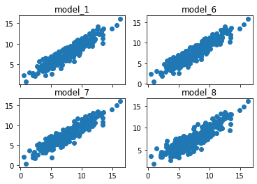

## Utkarsha Vidhale
# Sales of Child Car Seats Analysis
Dataset : https://r-data.pmagunia.com/dataset/r-dataset-package-islr-carseats

This dataset is a part of ISLR package. I tried to perform some analysis in Python instead of R .


### Libraries used:


```python
import numpy as np
import pandas as pd
import statsmodels.api as sm
import seaborn as sns
import matplotlib.pyplot as plt
from heatmap import heatmap, corrplot
from sklearn.tree import DecisionTreeClassifier 
from sklearn import tree
from sklearn import linear_model
from sklearn.metrics import mean_squared_error, r2_score
import math 
import statsmodels.api as sm
from statsmodels.formula.api import ols
from sklearn.linear_model import LinearRegression
from sklearn import metrics
import statsmodels.formula.api as SM
```

### Loading the dataset


```python
df = pd.read_csv('Carseats.csv')
df.head()
```


<div>
<style scoped>
    .dataframe tbody tr th:only-of-type {
        vertical-align: middle;
    }

    .dataframe tbody tr th {
        vertical-align: top;
    }

    .dataframe thead th {
        text-align: right;
    }
</style>
<table border="1" class="dataframe">
  <thead>
    <tr style="text-align: right;">
      <th></th>
      <th>Sales</th>
      <th>CompPrice</th>
      <th>Income</th>
      <th>Advertising</th>
      <th>Population</th>
      <th>Price</th>
      <th>ShelveLoc</th>
      <th>Age</th>
      <th>Education</th>
      <th>Urban</th>
      <th>US</th>
    </tr>
  </thead>
  <tbody>
    <tr>
      <th>0</th>
      <td>9.50</td>
      <td>138</td>
      <td>73</td>
      <td>11</td>
      <td>276</td>
      <td>120</td>
      <td>Bad</td>
      <td>42</td>
      <td>17</td>
      <td>Yes</td>
      <td>Yes</td>
    </tr>
    <tr>
      <th>1</th>
      <td>11.22</td>
      <td>111</td>
      <td>48</td>
      <td>16</td>
      <td>260</td>
      <td>83</td>
      <td>Good</td>
      <td>65</td>
      <td>10</td>
      <td>Yes</td>
      <td>Yes</td>
    </tr>
    <tr>
      <th>2</th>
      <td>10.06</td>
      <td>113</td>
      <td>35</td>
      <td>10</td>
      <td>269</td>
      <td>80</td>
      <td>Medium</td>
      <td>59</td>
      <td>12</td>
      <td>Yes</td>
      <td>Yes</td>
    </tr>
    <tr>
      <th>3</th>
      <td>7.40</td>
      <td>117</td>
      <td>100</td>
      <td>4</td>
      <td>466</td>
      <td>97</td>
      <td>Medium</td>
      <td>55</td>
      <td>14</td>
      <td>Yes</td>
      <td>Yes</td>
    </tr>
    <tr>
      <th>4</th>
      <td>4.15</td>
      <td>141</td>
      <td>64</td>
      <td>3</td>
      <td>340</td>
      <td>128</td>
      <td>Bad</td>
      <td>38</td>
      <td>13</td>
      <td>Yes</td>
      <td>No</td>
    </tr>
  </tbody>
</table>
</div>


```python
df.dtypes
```


    Sales          float64
    CompPrice        int64
    Income           int64
    Advertising      int64
    Population       int64
    Price            int64
    ShelveLoc       object
    Age              int64
    Education        int64
    Urban           object
    US              object
    dtype: object


```python
df.isnull().sum()
```


    Sales          0
    CompPrice      0
    Income         0
    Advertising    0
    Population     0
    Price          0
    ShelveLoc      0
    Age            0
    Education      0
    Urban          0
    US             0
    dtype: int64


We will be trying to predict the sales of carseats. In this data set, a single observation represents a location where carseats are sold.

- Sales - Unit sales (in thousands) at each location 


- CompPrice - Price charged by competitor at each location 


- Income - Community income level (in thousands of dollars) 


- Advertising - Local advertising budget for company at each location (in thousands of dollars) 


- Population - Population size in region (in thousands) 


- Price - Price company charges for car seats at each site 


- ShelveLoc - A factor with levels Bad, Good and Medium indicating the quality of the shelving location for the car seats at each site 


- Age - Average age of the local population 


- Education - Education level at each location 


- Urban - A factor with levels No and Yes to indicate whether the store is in an urban or rural location 


- US - A factor with levels No and Yes to indicate whether the store is in the US or not 


```python
df_dummy = pd.get_dummies(df,drop_first=True)
```


```python
df_dummy.head()
```


<div>
<style scoped>
    .dataframe tbody tr th:only-of-type {
        vertical-align: middle;
    }

    .dataframe tbody tr th {
        vertical-align: top;
    }

    .dataframe thead th {
        text-align: right;
    }
</style>
<table border="1" class="dataframe">
  <thead>
    <tr style="text-align: right;">
      <th></th>
      <th>Sales</th>
      <th>CompPrice</th>
      <th>Income</th>
      <th>Advertising</th>
      <th>Population</th>
      <th>Price</th>
      <th>Age</th>
      <th>Education</th>
      <th>ShelveLoc_Good</th>
      <th>ShelveLoc_Medium</th>
      <th>Urban_Yes</th>
      <th>US_Yes</th>
    </tr>
  </thead>
  <tbody>
    <tr>
      <th>0</th>
      <td>9.50</td>
      <td>138</td>
      <td>73</td>
      <td>11</td>
      <td>276</td>
      <td>120</td>
      <td>42</td>
      <td>17</td>
      <td>0</td>
      <td>0</td>
      <td>1</td>
      <td>1</td>
    </tr>
    <tr>
      <th>1</th>
      <td>11.22</td>
      <td>111</td>
      <td>48</td>
      <td>16</td>
      <td>260</td>
      <td>83</td>
      <td>65</td>
      <td>10</td>
      <td>1</td>
      <td>0</td>
      <td>1</td>
      <td>1</td>
    </tr>
    <tr>
      <th>2</th>
      <td>10.06</td>
      <td>113</td>
      <td>35</td>
      <td>10</td>
      <td>269</td>
      <td>80</td>
      <td>59</td>
      <td>12</td>
      <td>0</td>
      <td>1</td>
      <td>1</td>
      <td>1</td>
    </tr>
    <tr>
      <th>3</th>
      <td>7.40</td>
      <td>117</td>
      <td>100</td>
      <td>4</td>
      <td>466</td>
      <td>97</td>
      <td>55</td>
      <td>14</td>
      <td>0</td>
      <td>1</td>
      <td>1</td>
      <td>1</td>
    </tr>
    <tr>
      <th>4</th>
      <td>4.15</td>
      <td>141</td>
      <td>64</td>
      <td>3</td>
      <td>340</td>
      <td>128</td>
      <td>38</td>
      <td>13</td>
      <td>0</td>
      <td>0</td>
      <td>1</td>
      <td>0</td>
    </tr>
  </tbody>
</table>
</div>


### Boxplots
#### Sales and ShelveLoc


```python
sns.boxplot(x='ShelveLoc' ,y='Sales' ,data=df)
```


    <AxesSubplot:xlabel='ShelveLoc', ylabel='Sales'>


    

    


#### Sales and Urban


```python
sns.boxplot(y='Sales' ,x='Urban' ,data=df)
```


    <AxesSubplot:xlabel='Urban', ylabel='Sales'>


    

    


#### Sales and US


```python
sns.boxplot(x='US' ,y='Sales' ,data=df)
```


    <AxesSubplot:xlabel='US', ylabel='Sales'>


    

    


### Correlating the quantitative variabls :


```python
correlation_matrix = df.corr()
print(correlation_matrix)
```

                    Sales  CompPrice    Income  Advertising  Population     Price  \
    Sales        1.000000   0.064079  0.151951     0.269507    0.050471 -0.444951   
    CompPrice    0.064079   1.000000 -0.080653    -0.024199   -0.094707  0.584848   
    Income       0.151951  -0.080653  1.000000     0.058995   -0.007877 -0.056698   
    Advertising  0.269507  -0.024199  0.058995     1.000000    0.265652  0.044537   
    Population   0.050471  -0.094707 -0.007877     0.265652    1.000000 -0.012144   
    Price       -0.444951   0.584848 -0.056698     0.044537   -0.012144  1.000000   
    Age         -0.231815  -0.100239 -0.004670    -0.004557   -0.042663 -0.102177   
    Education   -0.051955   0.025197 -0.056855    -0.033594   -0.106378  0.011747   
    
                      Age  Education  
    Sales       -0.231815  -0.051955  
    CompPrice   -0.100239   0.025197  
    Income      -0.004670  -0.056855  
    Advertising -0.004557  -0.033594  
    Population  -0.042663  -0.106378  
    Price       -0.102177   0.011747  
    Age          1.000000   0.006488  
    Education    0.006488   1.000000  
    

As compared to other variables, `Sales` have lowest correlation with `Population` followed by `Education` and `CompPrice`.


### Transforming variables

##### 1. `Population`


```python
plt.plot(df['Sales'],df['Population'] , 'o', color='black');
plt.xlabel('Sales')
plt.ylabel('Population')
plt.title('Sales & Population')

```


    Text(0.5, 1.0, 'Sales & Population')


    

    


```python
sns.distplot(df['Population'],kde=True).set_title('Distribution of Population')
```

    D:\anaconda3\lib\site-packages\seaborn\distributions.py:2551: FutureWarning: `distplot` is a deprecated function and will be removed in a future version. Please adapt your code to use either `displot` (a figure-level function with similar flexibility) or `histplot` (an axes-level function for histograms).
      warnings.warn(msg, FutureWarning)
    


    Text(0.5, 1.0, 'Distribution of Population')


    

    


 - Square Transformation:


```python
Pop = df['Population']*df['Population']
r2 = np.corrcoef(df['Sales'], Pop)
print(r2)
```

    [[1.         0.04163059]
     [0.04163059 1.        ]]
    

 - Inverse Transformation


```python
Pop_inv = 1/df['Population']
r4 = np.corrcoef(df['Sales'], Pop)
print(r4)
```

    [[1.         0.04163059]
     [0.04163059 1.        ]]
    

##### There is no change in the correlation between `Sales` and `Population` even after performing Square and Inverse transformation.

But from the business pont of view, `Sales` is an important variable. 

##### 2. `ComPprice`


```python
plt.plot(df['Sales'],df['CompPrice'] , 'o', color='black');
plt.xlabel('Sales')
plt.ylabel('CompPrice')
plt.title('Sales & CompPrice')

```


    Text(0.5, 1.0, 'Sales & CompPrice')


    

    


```python
sns.distplot(df['CompPrice'],kde=True).set_title('Distribution of CompPrice')
```

    D:\anaconda3\lib\site-packages\seaborn\distributions.py:2551: FutureWarning: `distplot` is a deprecated function and will be removed in a future version. Please adapt your code to use either `displot` (a figure-level function with similar flexibility) or `histplot` (an axes-level function for histograms).
      warnings.warn(msg, FutureWarning)
    


    Text(0.5, 1.0, 'Distribution of CompPrice')


    

    


 - Square Transformation:


```python
comp = df['CompPrice']*df['CompPrice']
r2 = np.corrcoef(df['Sales'], comp)
print(r2)
```

    [[1.         0.06988937]
     [0.06988937 1.        ]]
    

 - Inverse Transformation


```python
comp_inv = 1/df['CompPrice']
r4 = np.corrcoef(df['Sales'], comp_inv)
print(r4)
```

    [[ 1.         -0.04886374]
     [-0.04886374  1.        ]]
    

There is no change in the correlation between `Sales` and `CompPrice` even after performing Square and Inverse transformation. 
But from the business point of view, `CompPrice` is an important variable.
    

##### 5. `Education`


```python
df.Education.value_counts()
```


    17    49
    12    49
    11    48
    10    48
    16    47
    13    43
    18    40
    14    40
    15    36
    Name: Education, dtype: int64


Education is ordinal variable with values ranging from 10 to 18.  

ANOVA test should be used to check the correlation between `Education` and `Sales`.


```python
sns.boxplot(x='Education' ,y='Sales' ,data=df).set_title("Sales and Edication")
```


    Text(0.5, 1.0, 'Sales and Edication')


    

    


```python
Edu = df['Education']
Sal = df['Sales']
model = ols('Edu ~ C(Sal)', data=df).fit()
aov_table = sm.stats.anova_lm(model, typ=2)
aov_table
```


<div>
<style scoped>
    .dataframe tbody tr th:only-of-type {
        vertical-align: middle;
    }

    .dataframe tbody tr th {
        vertical-align: top;
    }

    .dataframe thead th {
        text-align: right;
    }
</style>
<table border="1" class="dataframe">
  <thead>
    <tr style="text-align: right;">
      <th></th>
      <th>sum_sq</th>
      <th>df</th>
      <th>F</th>
      <th>PR(&gt;F)</th>
    </tr>
  </thead>
  <tbody>
    <tr>
      <th>C(Sal)</th>
      <td>2276.916667</td>
      <td>335.0</td>
      <td>0.939341</td>
      <td>0.644242</td>
    </tr>
    <tr>
      <th>Residual</th>
      <td>463.083333</td>
      <td>64.0</td>
      <td>NaN</td>
      <td>NaN</td>
    </tr>
  </tbody>
</table>
</div>


As the p value derieved is more than significance level, it can be stated that there is no significant association between `Sales` and `Education`. 


```python
plt.figure(figsize=(15,8))
sns.heatmap(df_dummy.corr(),annot=True)
plt.show()
```


    

    


```python
df_dummy.head()
```


<div>
<style scoped>
    .dataframe tbody tr th:only-of-type {
        vertical-align: middle;
    }

    .dataframe tbody tr th {
        vertical-align: top;
    }

    .dataframe thead th {
        text-align: right;
    }
</style>
<table border="1" class="dataframe">
  <thead>
    <tr style="text-align: right;">
      <th></th>
      <th>Sales</th>
      <th>CompPrice</th>
      <th>Income</th>
      <th>Advertising</th>
      <th>Population</th>
      <th>Price</th>
      <th>Age</th>
      <th>Education</th>
      <th>ShelveLoc_Good</th>
      <th>ShelveLoc_Medium</th>
      <th>Urban_Yes</th>
      <th>US_Yes</th>
    </tr>
  </thead>
  <tbody>
    <tr>
      <th>0</th>
      <td>9.50</td>
      <td>138</td>
      <td>73</td>
      <td>11</td>
      <td>276</td>
      <td>120</td>
      <td>42</td>
      <td>17</td>
      <td>0</td>
      <td>0</td>
      <td>1</td>
      <td>1</td>
    </tr>
    <tr>
      <th>1</th>
      <td>11.22</td>
      <td>111</td>
      <td>48</td>
      <td>16</td>
      <td>260</td>
      <td>83</td>
      <td>65</td>
      <td>10</td>
      <td>1</td>
      <td>0</td>
      <td>1</td>
      <td>1</td>
    </tr>
    <tr>
      <th>2</th>
      <td>10.06</td>
      <td>113</td>
      <td>35</td>
      <td>10</td>
      <td>269</td>
      <td>80</td>
      <td>59</td>
      <td>12</td>
      <td>0</td>
      <td>1</td>
      <td>1</td>
      <td>1</td>
    </tr>
    <tr>
      <th>3</th>
      <td>7.40</td>
      <td>117</td>
      <td>100</td>
      <td>4</td>
      <td>466</td>
      <td>97</td>
      <td>55</td>
      <td>14</td>
      <td>0</td>
      <td>1</td>
      <td>1</td>
      <td>1</td>
    </tr>
    <tr>
      <th>4</th>
      <td>4.15</td>
      <td>141</td>
      <td>64</td>
      <td>3</td>
      <td>340</td>
      <td>128</td>
      <td>38</td>
      <td>13</td>
      <td>0</td>
      <td>0</td>
      <td>1</td>
      <td>0</td>
    </tr>
  </tbody>
</table>
</div>


#### We will use the whole data to perform basics of Exploratory Data Analysis and then use the data to build descriptive models.

##### Model using appropriate number of dummy variable levels.


```python
formula_MLR_1 ='Sales~CompPrice+Income+Advertising+Population+Price+Age+Education+ShelveLoc_Good+ShelveLoc_Medium+Urban_Yes+US_Yes'
```


```python
model_MLR_1 = SM.ols(formula=formula_MLR_1,data=df_dummy).fit()
model_MLR_1.summary()
```


<table class="simpletable">
<caption>OLS Regression Results</caption>
<tr>
  <th>Dep. Variable:</th>          <td>Sales</td>      <th>  R-squared:         </th> <td>   0.873</td> 
</tr>
<tr>
  <th>Model:</th>                   <td>OLS</td>       <th>  Adj. R-squared:    </th> <td>   0.870</td> 
</tr>
<tr>
  <th>Method:</th>             <td>Least Squares</td>  <th>  F-statistic:       </th> <td>   243.4</td> 
</tr>
<tr>
  <th>Date:</th>             <td>Sun, 27 Dec 2020</td> <th>  Prob (F-statistic):</th> <td>1.60e-166</td>
</tr>
<tr>
  <th>Time:</th>                 <td>12:29:31</td>     <th>  Log-Likelihood:    </th> <td> -568.99</td> 
</tr>
<tr>
  <th>No. Observations:</th>      <td>   400</td>      <th>  AIC:               </th> <td>   1162.</td> 
</tr>
<tr>
  <th>Df Residuals:</th>          <td>   388</td>      <th>  BIC:               </th> <td>   1210.</td> 
</tr>
<tr>
  <th>Df Model:</th>              <td>    11</td>      <th>                     </th>     <td> </td>    
</tr>
<tr>
  <th>Covariance Type:</th>      <td>nonrobust</td>    <th>                     </th>     <td> </td>    
</tr>
</table>
<table class="simpletable">
<tr>
          <td></td>            <th>coef</th>     <th>std err</th>      <th>t</th>      <th>P>|t|</th>  <th>[0.025</th>    <th>0.975]</th>  
</tr>
<tr>
  <th>Intercept</th>        <td>    5.6606</td> <td>    0.603</td> <td>    9.380</td> <td> 0.000</td> <td>    4.474</td> <td>    6.847</td>
</tr>
<tr>
  <th>CompPrice</th>        <td>    0.0928</td> <td>    0.004</td> <td>   22.378</td> <td> 0.000</td> <td>    0.085</td> <td>    0.101</td>
</tr>
<tr>
  <th>Income</th>           <td>    0.0158</td> <td>    0.002</td> <td>    8.565</td> <td> 0.000</td> <td>    0.012</td> <td>    0.019</td>
</tr>
<tr>
  <th>Advertising</th>      <td>    0.1231</td> <td>    0.011</td> <td>   11.066</td> <td> 0.000</td> <td>    0.101</td> <td>    0.145</td>
</tr>
<tr>
  <th>Population</th>       <td>    0.0002</td> <td>    0.000</td> <td>    0.561</td> <td> 0.575</td> <td>   -0.001</td> <td>    0.001</td>
</tr>
<tr>
  <th>Price</th>            <td>   -0.0954</td> <td>    0.003</td> <td>  -35.700</td> <td> 0.000</td> <td>   -0.101</td> <td>   -0.090</td>
</tr>
<tr>
  <th>Age</th>              <td>   -0.0460</td> <td>    0.003</td> <td>  -14.472</td> <td> 0.000</td> <td>   -0.052</td> <td>   -0.040</td>
</tr>
<tr>
  <th>Education</th>        <td>   -0.0211</td> <td>    0.020</td> <td>   -1.070</td> <td> 0.285</td> <td>   -0.060</td> <td>    0.018</td>
</tr>
<tr>
  <th>ShelveLoc_Good</th>   <td>    4.8502</td> <td>    0.153</td> <td>   31.678</td> <td> 0.000</td> <td>    4.549</td> <td>    5.151</td>
</tr>
<tr>
  <th>ShelveLoc_Medium</th> <td>    1.9567</td> <td>    0.126</td> <td>   15.516</td> <td> 0.000</td> <td>    1.709</td> <td>    2.205</td>
</tr>
<tr>
  <th>Urban_Yes</th>        <td>    0.1229</td> <td>    0.113</td> <td>    1.088</td> <td> 0.277</td> <td>   -0.099</td> <td>    0.345</td>
</tr>
<tr>
  <th>US_Yes</th>           <td>   -0.1841</td> <td>    0.150</td> <td>   -1.229</td> <td> 0.220</td> <td>   -0.479</td> <td>    0.111</td>
</tr>
</table>
<table class="simpletable">
<tr>
  <th>Omnibus:</th>       <td> 0.811</td> <th>  Durbin-Watson:     </th> <td>   2.013</td>
</tr>
<tr>
  <th>Prob(Omnibus):</th> <td> 0.667</td> <th>  Jarque-Bera (JB):  </th> <td>   0.765</td>
</tr>
<tr>
  <th>Skew:</th>          <td> 0.107</td> <th>  Prob(JB):          </th> <td>   0.682</td>
</tr>
<tr>
  <th>Kurtosis:</th>      <td> 2.994</td> <th>  Cond. No.          </th> <td>4.15e+03</td>
</tr>
</table><br/><br/>Notes:<br/>[1] Standard Errors assume that the covariance matrix of the errors is correctly specified.<br/>[2] The condition number is large, 4.15e+03. This might indicate that there are<br/>strong multicollinearity or other numerical problems.


We notice that the p-value for the t-statistic calculation for the `Population` variable is the highest (higher than 0.05).

For the $\underline{t-statistic}$ for every co-efficient of the Linear Regression the null and alternate Hypothesis is as follows:

${H_0}$ : The variable is significant. 

${H_1}$: The variable is not significant. 

Lower the p-value for the t-statistic more significant are the variables.

##### Model without the 'Population' variable


```python
formula_MLR_2 = 'Sales~CompPrice+Income+Advertising+Price+Age+Education+ShelveLoc_Good+ShelveLoc_Medium+Urban_Yes+US_Yes'
```


```python
model_MLR_2 = SM.ols(formula=formula_MLR_2,data=df_dummy).fit()
model_MLR_2.summary()
```


<table class="simpletable">
<caption>OLS Regression Results</caption>
<tr>
  <th>Dep. Variable:</th>          <td>Sales</td>      <th>  R-squared:         </th> <td>   0.873</td> 
</tr>
<tr>
  <th>Model:</th>                   <td>OLS</td>       <th>  Adj. R-squared:    </th> <td>   0.870</td> 
</tr>
<tr>
  <th>Method:</th>             <td>Least Squares</td>  <th>  F-statistic:       </th> <td>   268.2</td> 
</tr>
<tr>
  <th>Date:</th>             <td>Sun, 27 Dec 2020</td> <th>  Prob (F-statistic):</th> <td>1.11e-167</td>
</tr>
<tr>
  <th>Time:</th>                 <td>12:29:31</td>     <th>  Log-Likelihood:    </th> <td> -569.15</td> 
</tr>
<tr>
  <th>No. Observations:</th>      <td>   400</td>      <th>  AIC:               </th> <td>   1160.</td> 
</tr>
<tr>
  <th>Df Residuals:</th>          <td>   389</td>      <th>  BIC:               </th> <td>   1204.</td> 
</tr>
<tr>
  <th>Df Model:</th>              <td>    10</td>      <th>                     </th>     <td> </td>    
</tr>
<tr>
  <th>Covariance Type:</th>      <td>nonrobust</td>    <th>                     </th>     <td> </td>    
</tr>
</table>
<table class="simpletable">
<tr>
          <td></td>            <th>coef</th>     <th>std err</th>      <th>t</th>      <th>P>|t|</th>  <th>[0.025</th>    <th>0.975]</th>  
</tr>
<tr>
  <th>Intercept</th>        <td>    5.7619</td> <td>    0.575</td> <td>   10.015</td> <td> 0.000</td> <td>    4.631</td> <td>    6.893</td>
</tr>
<tr>
  <th>CompPrice</th>        <td>    0.0926</td> <td>    0.004</td> <td>   22.436</td> <td> 0.000</td> <td>    0.084</td> <td>    0.101</td>
</tr>
<tr>
  <th>Income</th>           <td>    0.0158</td> <td>    0.002</td> <td>    8.560</td> <td> 0.000</td> <td>    0.012</td> <td>    0.019</td>
</tr>
<tr>
  <th>Advertising</th>      <td>    0.1250</td> <td>    0.011</td> <td>   11.844</td> <td> 0.000</td> <td>    0.104</td> <td>    0.146</td>
</tr>
<tr>
  <th>Price</th>            <td>   -0.0953</td> <td>    0.003</td> <td>  -35.736</td> <td> 0.000</td> <td>   -0.101</td> <td>   -0.090</td>
</tr>
<tr>
  <th>Age</th>              <td>   -0.0461</td> <td>    0.003</td> <td>  -14.520</td> <td> 0.000</td> <td>   -0.052</td> <td>   -0.040</td>
</tr>
<tr>
  <th>Education</th>        <td>   -0.0224</td> <td>    0.020</td> <td>   -1.145</td> <td> 0.253</td> <td>   -0.061</td> <td>    0.016</td>
</tr>
<tr>
  <th>ShelveLoc_Good</th>   <td>    4.8467</td> <td>    0.153</td> <td>   31.709</td> <td> 0.000</td> <td>    4.546</td> <td>    5.147</td>
</tr>
<tr>
  <th>ShelveLoc_Medium</th> <td>    1.9521</td> <td>    0.126</td> <td>   15.526</td> <td> 0.000</td> <td>    1.705</td> <td>    2.199</td>
</tr>
<tr>
  <th>Urban_Yes</th>        <td>    0.1189</td> <td>    0.113</td> <td>    1.055</td> <td> 0.292</td> <td>   -0.103</td> <td>    0.340</td>
</tr>
<tr>
  <th>US_Yes</th>           <td>   -0.1991</td> <td>    0.147</td> <td>   -1.351</td> <td> 0.177</td> <td>   -0.489</td> <td>    0.091</td>
</tr>
</table>
<table class="simpletable">
<tr>
  <th>Omnibus:</th>       <td> 0.899</td> <th>  Durbin-Watson:     </th> <td>   2.016</td>
</tr>
<tr>
  <th>Prob(Omnibus):</th> <td> 0.638</td> <th>  Jarque-Bera (JB):  </th> <td>   0.826</td>
</tr>
<tr>
  <th>Skew:</th>          <td> 0.111</td> <th>  Prob(JB):          </th> <td>   0.662</td>
</tr>
<tr>
  <th>Kurtosis:</th>      <td> 3.012</td> <th>  Cond. No.          </th> <td>2.19e+03</td>
</tr>
</table><br/><br/>Notes:<br/>[1] Standard Errors assume that the covariance matrix of the errors is correctly specified.<br/>[2] The condition number is large, 2.19e+03. This might indicate that there are<br/>strong multicollinearity or other numerical problems.


There is almost no change in the ${R^2}$ values. 


While adding or subtracting variables from a regression model to refine the model, we need to be very careful about the Adjusted ${R^2}$ values. Adding any particular value which is not significant can increase the ${R^2}$ value but the Adjusted ${R^2}$ changes by the addition or the subtraction of significant variables. 


Let us check the $R^2$ and adjusted $R^2$ values for the $1^{st}$ and $2^{nd}$ Multiple Linear Regression Model.


```python
print('For the FIRST MLR model:','\n')

print('Rsquared         ',model_MLR_1.rsquared)
print('Adjusted Rsquared',model_MLR_1.rsquared_adj)
```

    For the FIRST MLR model: 
    
    Rsquared          0.8734133434127012
    Adjusted Rsquared 0.8698245464475973
    


```python
print('For the SECOND MLR model:','\n')

print('Rsquared         ',model_MLR_2.rsquared)
print('Adjusted Rsquared',model_MLR_2.rsquared_adj)
```

    For the SECOND MLR model: 
    
    Rsquared          0.8733106136278912
    Adjusted Rsquared 0.8700538170630555
    

This means that the particular information about the store being located in the US does not help us in predicting the 'Sales' as compared to the other information that we have.

Let us see what happens when we drop a statistically significant variable from the model.

In this case,we will drop the `CompPrice` model.


```python
formula_MLR_3 = 'Sales~Income+Advertising+Price+Age+Education+ShelveLoc_Good+ShelveLoc_Medium+Urban_Yes+US_Yes'
```


```python
model_MLR_3 = SM.ols(formula=formula_MLR_3,data=df_dummy).fit()
```


```python
model_MLR_3.summary()
```


<table class="simpletable">
<caption>OLS Regression Results</caption>
<tr>
  <th>Dep. Variable:</th>          <td>Sales</td>      <th>  R-squared:         </th> <td>   0.709</td>
</tr>
<tr>
  <th>Model:</th>                   <td>OLS</td>       <th>  Adj. R-squared:    </th> <td>   0.703</td>
</tr>
<tr>
  <th>Method:</th>             <td>Least Squares</td>  <th>  F-statistic:       </th> <td>   105.8</td>
</tr>
<tr>
  <th>Date:</th>             <td>Sun, 27 Dec 2020</td> <th>  Prob (F-statistic):</th> <td>6.29e-99</td>
</tr>
<tr>
  <th>Time:</th>                 <td>12:29:31</td>     <th>  Log-Likelihood:    </th> <td> -735.21</td>
</tr>
<tr>
  <th>No. Observations:</th>      <td>   400</td>      <th>  AIC:               </th> <td>   1490.</td>
</tr>
<tr>
  <th>Df Residuals:</th>          <td>   390</td>      <th>  BIC:               </th> <td>   1530.</td>
</tr>
<tr>
  <th>Df Model:</th>              <td>     9</td>      <th>                     </th>     <td> </td>   
</tr>
<tr>
  <th>Covariance Type:</th>      <td>nonrobust</td>    <th>                     </th>     <td> </td>   
</tr>
</table>
<table class="simpletable">
<tr>
          <td></td>            <th>coef</th>     <th>std err</th>      <th>t</th>      <th>P>|t|</th>  <th>[0.025</th>    <th>0.975]</th>  
</tr>
<tr>
  <th>Intercept</th>        <td>   13.4510</td> <td>    0.699</td> <td>   19.243</td> <td> 0.000</td> <td>   12.077</td> <td>   14.825</td>
</tr>
<tr>
  <th>Income</th>           <td>    0.0134</td> <td>    0.003</td> <td>    4.820</td> <td> 0.000</td> <td>    0.008</td> <td>    0.019</td>
</tr>
<tr>
  <th>Advertising</th>      <td>    0.1087</td> <td>    0.016</td> <td>    6.821</td> <td> 0.000</td> <td>    0.077</td> <td>    0.140</td>
</tr>
<tr>
  <th>Price</th>            <td>   -0.0608</td> <td>    0.003</td> <td>  -18.446</td> <td> 0.000</td> <td>   -0.067</td> <td>   -0.054</td>
</tr>
<tr>
  <th>Age</th>              <td>   -0.0500</td> <td>    0.005</td> <td>  -10.432</td> <td> 0.000</td> <td>   -0.059</td> <td>   -0.041</td>
</tr>
<tr>
  <th>Education</th>        <td>   -0.0125</td> <td>    0.030</td> <td>   -0.422</td> <td> 0.673</td> <td>   -0.071</td> <td>    0.046</td>
</tr>
<tr>
  <th>ShelveLoc_Good</th>   <td>    4.9019</td> <td>    0.231</td> <td>   21.204</td> <td> 0.000</td> <td>    4.447</td> <td>    5.356</td>
</tr>
<tr>
  <th>ShelveLoc_Medium</th> <td>    2.0223</td> <td>    0.190</td> <td>   10.636</td> <td> 0.000</td> <td>    1.648</td> <td>    2.396</td>
</tr>
<tr>
  <th>Urban_Yes</th>        <td>    0.2621</td> <td>    0.170</td> <td>    1.540</td> <td> 0.124</td> <td>   -0.072</td> <td>    0.597</td>
</tr>
<tr>
  <th>US_Yes</th>           <td>   -0.0800</td> <td>    0.223</td> <td>   -0.359</td> <td> 0.720</td> <td>   -0.518</td> <td>    0.358</td>
</tr>
</table>
<table class="simpletable">
<tr>
  <th>Omnibus:</th>       <td> 0.242</td> <th>  Durbin-Watson:     </th> <td>   1.938</td>
</tr>
<tr>
  <th>Prob(Omnibus):</th> <td> 0.886</td> <th>  Jarque-Bera (JB):  </th> <td>   0.245</td>
</tr>
<tr>
  <th>Skew:</th>          <td> 0.059</td> <th>  Prob(JB):          </th> <td>   0.885</td>
</tr>
<tr>
  <th>Kurtosis:</th>      <td> 2.971</td> <th>  Cond. No.          </th> <td>1.34e+03</td>
</tr>
</table><br/><br/>Notes:<br/>[1] Standard Errors assume that the covariance matrix of the errors is correctly specified.<br/>[2] The condition number is large, 1.34e+03. This might indicate that there are<br/>strong multicollinearity or other numerical problems.


As per our understanding, we see that both the Adjusted ${R^2}$ and the ${R^2}$ values have dropped massively. The p-values of t-statistic of certain variables have also changed. This indicates that as per the last iteration of the model a few values have become more important.  


Let us again the model before dropping any statistically significant variables.


```python
model_MLR_2.summary()
```


<table class="simpletable">
<caption>OLS Regression Results</caption>
<tr>
  <th>Dep. Variable:</th>          <td>Sales</td>      <th>  R-squared:         </th> <td>   0.873</td> 
</tr>
<tr>
  <th>Model:</th>                   <td>OLS</td>       <th>  Adj. R-squared:    </th> <td>   0.870</td> 
</tr>
<tr>
  <th>Method:</th>             <td>Least Squares</td>  <th>  F-statistic:       </th> <td>   268.2</td> 
</tr>
<tr>
  <th>Date:</th>             <td>Sun, 27 Dec 2020</td> <th>  Prob (F-statistic):</th> <td>1.11e-167</td>
</tr>
<tr>
  <th>Time:</th>                 <td>12:29:31</td>     <th>  Log-Likelihood:    </th> <td> -569.15</td> 
</tr>
<tr>
  <th>No. Observations:</th>      <td>   400</td>      <th>  AIC:               </th> <td>   1160.</td> 
</tr>
<tr>
  <th>Df Residuals:</th>          <td>   389</td>      <th>  BIC:               </th> <td>   1204.</td> 
</tr>
<tr>
  <th>Df Model:</th>              <td>    10</td>      <th>                     </th>     <td> </td>    
</tr>
<tr>
  <th>Covariance Type:</th>      <td>nonrobust</td>    <th>                     </th>     <td> </td>    
</tr>
</table>
<table class="simpletable">
<tr>
          <td></td>            <th>coef</th>     <th>std err</th>      <th>t</th>      <th>P>|t|</th>  <th>[0.025</th>    <th>0.975]</th>  
</tr>
<tr>
  <th>Intercept</th>        <td>    5.7619</td> <td>    0.575</td> <td>   10.015</td> <td> 0.000</td> <td>    4.631</td> <td>    6.893</td>
</tr>
<tr>
  <th>CompPrice</th>        <td>    0.0926</td> <td>    0.004</td> <td>   22.436</td> <td> 0.000</td> <td>    0.084</td> <td>    0.101</td>
</tr>
<tr>
  <th>Income</th>           <td>    0.0158</td> <td>    0.002</td> <td>    8.560</td> <td> 0.000</td> <td>    0.012</td> <td>    0.019</td>
</tr>
<tr>
  <th>Advertising</th>      <td>    0.1250</td> <td>    0.011</td> <td>   11.844</td> <td> 0.000</td> <td>    0.104</td> <td>    0.146</td>
</tr>
<tr>
  <th>Price</th>            <td>   -0.0953</td> <td>    0.003</td> <td>  -35.736</td> <td> 0.000</td> <td>   -0.101</td> <td>   -0.090</td>
</tr>
<tr>
  <th>Age</th>              <td>   -0.0461</td> <td>    0.003</td> <td>  -14.520</td> <td> 0.000</td> <td>   -0.052</td> <td>   -0.040</td>
</tr>
<tr>
  <th>Education</th>        <td>   -0.0224</td> <td>    0.020</td> <td>   -1.145</td> <td> 0.253</td> <td>   -0.061</td> <td>    0.016</td>
</tr>
<tr>
  <th>ShelveLoc_Good</th>   <td>    4.8467</td> <td>    0.153</td> <td>   31.709</td> <td> 0.000</td> <td>    4.546</td> <td>    5.147</td>
</tr>
<tr>
  <th>ShelveLoc_Medium</th> <td>    1.9521</td> <td>    0.126</td> <td>   15.526</td> <td> 0.000</td> <td>    1.705</td> <td>    2.199</td>
</tr>
<tr>
  <th>Urban_Yes</th>        <td>    0.1189</td> <td>    0.113</td> <td>    1.055</td> <td> 0.292</td> <td>   -0.103</td> <td>    0.340</td>
</tr>
<tr>
  <th>US_Yes</th>           <td>   -0.1991</td> <td>    0.147</td> <td>   -1.351</td> <td> 0.177</td> <td>   -0.489</td> <td>    0.091</td>
</tr>
</table>
<table class="simpletable">
<tr>
  <th>Omnibus:</th>       <td> 0.899</td> <th>  Durbin-Watson:     </th> <td>   2.016</td>
</tr>
<tr>
  <th>Prob(Omnibus):</th> <td> 0.638</td> <th>  Jarque-Bera (JB):  </th> <td>   0.826</td>
</tr>
<tr>
  <th>Skew:</th>          <td> 0.111</td> <th>  Prob(JB):          </th> <td>   0.662</td>
</tr>
<tr>
  <th>Kurtosis:</th>      <td> 3.012</td> <th>  Cond. No.          </th> <td>2.19e+03</td>
</tr>
</table><br/><br/>Notes:<br/>[1] Standard Errors assume that the covariance matrix of the errors is correctly specified.<br/>[2] The condition number is large, 2.19e+03. This might indicate that there are<br/>strong multicollinearity or other numerical problems.


Let us now go ahead and drop the 'Urban_Yes' variable as that does not seem very statistically significant. 


```python
formula_MLR_4 = 'Sales~CompPrice+Income+Advertising+Price+Age+Education+ShelveLoc_Good+ShelveLoc_Medium+US_Yes'
```


```python
model_MLR_4 = SM.ols(formula=formula_MLR_4,data=df_dummy).fit()
```


```python
model_MLR_4.summary()
```


<table class="simpletable">
<caption>OLS Regression Results</caption>
<tr>
  <th>Dep. Variable:</th>          <td>Sales</td>      <th>  R-squared:         </th> <td>   0.873</td> 
</tr>
<tr>
  <th>Model:</th>                   <td>OLS</td>       <th>  Adj. R-squared:    </th> <td>   0.870</td> 
</tr>
<tr>
  <th>Method:</th>             <td>Least Squares</td>  <th>  F-statistic:       </th> <td>   297.7</td> 
</tr>
<tr>
  <th>Date:</th>             <td>Sun, 27 Dec 2020</td> <th>  Prob (F-statistic):</th> <td>1.09e-168</td>
</tr>
<tr>
  <th>Time:</th>                 <td>12:29:31</td>     <th>  Log-Likelihood:    </th> <td> -569.72</td> 
</tr>
<tr>
  <th>No. Observations:</th>      <td>   400</td>      <th>  AIC:               </th> <td>   1159.</td> 
</tr>
<tr>
  <th>Df Residuals:</th>          <td>   390</td>      <th>  BIC:               </th> <td>   1199.</td> 
</tr>
<tr>
  <th>Df Model:</th>              <td>     9</td>      <th>                     </th>     <td> </td>    
</tr>
<tr>
  <th>Covariance Type:</th>      <td>nonrobust</td>    <th>                     </th>     <td> </td>    
</tr>
</table>
<table class="simpletable">
<tr>
          <td></td>            <th>coef</th>     <th>std err</th>      <th>t</th>      <th>P>|t|</th>  <th>[0.025</th>    <th>0.975]</th>  
</tr>
<tr>
  <th>Intercept</th>        <td>    5.8140</td> <td>    0.573</td> <td>   10.142</td> <td> 0.000</td> <td>    4.687</td> <td>    6.941</td>
</tr>
<tr>
  <th>CompPrice</th>        <td>    0.0929</td> <td>    0.004</td> <td>   22.529</td> <td> 0.000</td> <td>    0.085</td> <td>    0.101</td>
</tr>
<tr>
  <th>Income</th>           <td>    0.0158</td> <td>    0.002</td> <td>    8.598</td> <td> 0.000</td> <td>    0.012</td> <td>    0.019</td>
</tr>
<tr>
  <th>Advertising</th>      <td>    0.1253</td> <td>    0.011</td> <td>   11.868</td> <td> 0.000</td> <td>    0.105</td> <td>    0.146</td>
</tr>
<tr>
  <th>Price</th>            <td>   -0.0953</td> <td>    0.003</td> <td>  -35.721</td> <td> 0.000</td> <td>   -0.101</td> <td>   -0.090</td>
</tr>
<tr>
  <th>Age</th>              <td>   -0.0460</td> <td>    0.003</td> <td>  -14.488</td> <td> 0.000</td> <td>   -0.052</td> <td>   -0.040</td>
</tr>
<tr>
  <th>Education</th>        <td>   -0.0231</td> <td>    0.020</td> <td>   -1.180</td> <td> 0.239</td> <td>   -0.062</td> <td>    0.015</td>
</tr>
<tr>
  <th>ShelveLoc_Good</th>   <td>    4.8339</td> <td>    0.152</td> <td>   31.721</td> <td> 0.000</td> <td>    4.534</td> <td>    5.133</td>
</tr>
<tr>
  <th>ShelveLoc_Medium</th> <td>    1.9422</td> <td>    0.125</td> <td>   15.489</td> <td> 0.000</td> <td>    1.696</td> <td>    2.189</td>
</tr>
<tr>
  <th>US_Yes</th>           <td>   -0.1968</td> <td>    0.147</td> <td>   -1.336</td> <td> 0.182</td> <td>   -0.486</td> <td>    0.093</td>
</tr>
</table>
<table class="simpletable">
<tr>
  <th>Omnibus:</th>       <td> 0.872</td> <th>  Durbin-Watson:     </th> <td>   2.009</td>
</tr>
<tr>
  <th>Prob(Omnibus):</th> <td> 0.647</td> <th>  Jarque-Bera (JB):  </th> <td>   0.832</td>
</tr>
<tr>
  <th>Skew:</th>          <td> 0.112</td> <th>  Prob(JB):          </th> <td>   0.660</td>
</tr>
<tr>
  <th>Kurtosis:</th>      <td> 2.989</td> <th>  Cond. No.          </th> <td>2.18e+03</td>
</tr>
</table><br/><br/>Notes:<br/>[1] Standard Errors assume that the covariance matrix of the errors is correctly specified.<br/>[2] The condition number is large, 2.18e+03. This might indicate that there are<br/>strong multicollinearity or other numerical problems.


Almost no change in the ${R^2}$ and Adjusted ${R^2}$ is observed thus confirming the fact that the variable was indeed not significant.

Now we will check the diagnostics of the model after dropping the 'Education' variable as that does not seem significant.


```python
formula_MLR_5 = 'Sales~CompPrice+Income+Advertising+Price+Age+ShelveLoc_Good+ShelveLoc_Medium+Urban_Yes'
```


```python
model_MLR_5 = SM.ols(formula=formula_MLR_5,data=df_dummy).fit()
```


```python
model_MLR_5.summary()
```


<table class="simpletable">
<caption>OLS Regression Results</caption>
<tr>
  <th>Dep. Variable:</th>          <td>Sales</td>      <th>  R-squared:         </th> <td>   0.872</td> 
</tr>
<tr>
  <th>Model:</th>                   <td>OLS</td>       <th>  Adj. R-squared:    </th> <td>   0.870</td> 
</tr>
<tr>
  <th>Method:</th>             <td>Least Squares</td>  <th>  F-statistic:       </th> <td>   334.0</td> 
</tr>
<tr>
  <th>Date:</th>             <td>Sun, 27 Dec 2020</td> <th>  Prob (F-statistic):</th> <td>1.43e-169</td>
</tr>
<tr>
  <th>Time:</th>                 <td>12:29:31</td>     <th>  Log-Likelihood:    </th> <td> -570.65</td> 
</tr>
<tr>
  <th>No. Observations:</th>      <td>   400</td>      <th>  AIC:               </th> <td>   1159.</td> 
</tr>
<tr>
  <th>Df Residuals:</th>          <td>   391</td>      <th>  BIC:               </th> <td>   1195.</td> 
</tr>
<tr>
  <th>Df Model:</th>              <td>     8</td>      <th>                     </th>     <td> </td>    
</tr>
<tr>
  <th>Covariance Type:</th>      <td>nonrobust</td>    <th>                     </th>     <td> </td>    
</tr>
</table>
<table class="simpletable">
<tr>
          <td></td>            <th>coef</th>     <th>std err</th>      <th>t</th>      <th>P>|t|</th>  <th>[0.025</th>    <th>0.975]</th>  
</tr>
<tr>
  <th>Intercept</th>        <td>    5.4316</td> <td>    0.507</td> <td>   10.723</td> <td> 0.000</td> <td>    4.436</td> <td>    6.428</td>
</tr>
<tr>
  <th>CompPrice</th>        <td>    0.0923</td> <td>    0.004</td> <td>   22.359</td> <td> 0.000</td> <td>    0.084</td> <td>    0.100</td>
</tr>
<tr>
  <th>Income</th>           <td>    0.0157</td> <td>    0.002</td> <td>    8.547</td> <td> 0.000</td> <td>    0.012</td> <td>    0.019</td>
</tr>
<tr>
  <th>Advertising</th>      <td>    0.1155</td> <td>    0.008</td> <td>   14.946</td> <td> 0.000</td> <td>    0.100</td> <td>    0.131</td>
</tr>
<tr>
  <th>Price</th>            <td>   -0.0954</td> <td>    0.003</td> <td>  -35.715</td> <td> 0.000</td> <td>   -0.101</td> <td>   -0.090</td>
</tr>
<tr>
  <th>Age</th>              <td>   -0.0463</td> <td>    0.003</td> <td>  -14.555</td> <td> 0.000</td> <td>   -0.053</td> <td>   -0.040</td>
</tr>
<tr>
  <th>ShelveLoc_Good</th>   <td>    4.8485</td> <td>    0.153</td> <td>   31.702</td> <td> 0.000</td> <td>    4.548</td> <td>    5.149</td>
</tr>
<tr>
  <th>ShelveLoc_Medium</th> <td>    1.9622</td> <td>    0.126</td> <td>   15.608</td> <td> 0.000</td> <td>    1.715</td> <td>    2.209</td>
</tr>
<tr>
  <th>Urban_Yes</th>        <td>    0.1206</td> <td>    0.113</td> <td>    1.070</td> <td> 0.285</td> <td>   -0.101</td> <td>    0.342</td>
</tr>
</table>
<table class="simpletable">
<tr>
  <th>Omnibus:</th>       <td> 0.775</td> <th>  Durbin-Watson:     </th> <td>   1.997</td>
</tr>
<tr>
  <th>Prob(Omnibus):</th> <td> 0.679</td> <th>  Jarque-Bera (JB):  </th> <td>   0.778</td>
</tr>
<tr>
  <th>Skew:</th>          <td> 0.106</td> <th>  Prob(JB):          </th> <td>   0.678</td>
</tr>
<tr>
  <th>Kurtosis:</th>      <td> 2.961</td> <th>  Cond. No.          </th> <td>1.92e+03</td>
</tr>
</table><br/><br/>Notes:<br/>[1] Standard Errors assume that the covariance matrix of the errors is correctly specified.<br/>[2] The condition number is large, 1.92e+03. This might indicate that there are<br/>strong multicollinearity or other numerical problems.


From the above model we can thus conclude that the Education level at location of the store is not a significant variable when it comes to predicting the sales.

From the p-value of the $t_{statistic}$ of 'Urban_Yes', the variable does not seem significant. We will run the model by dropping the variable and then we will again check the values of $R^2$ and adjusted $R^2$.


```python
formula_MLR_6 = 'Sales~CompPrice+Income+Advertising+Price+Age+ShelveLoc_Good+ShelveLoc_Medium'
```


```python
model_MLR_6 = SM.ols(formula=formula_MLR_6,data=df_dummy).fit()
```


```python
model_MLR_6.summary()
```


<table class="simpletable">
<caption>OLS Regression Results</caption>
<tr>
  <th>Dep. Variable:</th>          <td>Sales</td>      <th>  R-squared:         </th> <td>   0.872</td> 
</tr>
<tr>
  <th>Model:</th>                   <td>OLS</td>       <th>  Adj. R-squared:    </th> <td>   0.870</td> 
</tr>
<tr>
  <th>Method:</th>             <td>Least Squares</td>  <th>  F-statistic:       </th> <td>   381.4</td> 
</tr>
<tr>
  <th>Date:</th>             <td>Sun, 27 Dec 2020</td> <th>  Prob (F-statistic):</th> <td>1.25e-170</td>
</tr>
<tr>
  <th>Time:</th>                 <td>12:29:31</td>     <th>  Log-Likelihood:    </th> <td> -571.24</td> 
</tr>
<tr>
  <th>No. Observations:</th>      <td>   400</td>      <th>  AIC:               </th> <td>   1158.</td> 
</tr>
<tr>
  <th>Df Residuals:</th>          <td>   392</td>      <th>  BIC:               </th> <td>   1190.</td> 
</tr>
<tr>
  <th>Df Model:</th>              <td>     7</td>      <th>                     </th>     <td> </td>    
</tr>
<tr>
  <th>Covariance Type:</th>      <td>nonrobust</td>    <th>                     </th>     <td> </td>    
</tr>
</table>
<table class="simpletable">
<tr>
          <td></td>            <th>coef</th>     <th>std err</th>      <th>t</th>      <th>P>|t|</th>  <th>[0.025</th>    <th>0.975]</th>  
</tr>
<tr>
  <th>Intercept</th>        <td>    5.4752</td> <td>    0.505</td> <td>   10.842</td> <td> 0.000</td> <td>    4.482</td> <td>    6.468</td>
</tr>
<tr>
  <th>CompPrice</th>        <td>    0.0926</td> <td>    0.004</td> <td>   22.451</td> <td> 0.000</td> <td>    0.084</td> <td>    0.101</td>
</tr>
<tr>
  <th>Income</th>           <td>    0.0158</td> <td>    0.002</td> <td>    8.590</td> <td> 0.000</td> <td>    0.012</td> <td>    0.019</td>
</tr>
<tr>
  <th>Advertising</th>      <td>    0.1159</td> <td>    0.008</td> <td>   15.006</td> <td> 0.000</td> <td>    0.101</td> <td>    0.131</td>
</tr>
<tr>
  <th>Price</th>            <td>   -0.0953</td> <td>    0.003</td> <td>  -35.699</td> <td> 0.000</td> <td>   -0.101</td> <td>   -0.090</td>
</tr>
<tr>
  <th>Age</th>              <td>   -0.0461</td> <td>    0.003</td> <td>  -14.521</td> <td> 0.000</td> <td>   -0.052</td> <td>   -0.040</td>
</tr>
<tr>
  <th>ShelveLoc_Good</th>   <td>    4.8357</td> <td>    0.152</td> <td>   31.710</td> <td> 0.000</td> <td>    4.536</td> <td>    5.135</td>
</tr>
<tr>
  <th>ShelveLoc_Medium</th> <td>    1.9520</td> <td>    0.125</td> <td>   15.569</td> <td> 0.000</td> <td>    1.706</td> <td>    2.198</td>
</tr>
</table>
<table class="simpletable">
<tr>
  <th>Omnibus:</th>       <td> 0.766</td> <th>  Durbin-Watson:     </th> <td>   1.988</td>
</tr>
<tr>
  <th>Prob(Omnibus):</th> <td> 0.682</td> <th>  Jarque-Bera (JB):  </th> <td>   0.810</td>
</tr>
<tr>
  <th>Skew:</th>          <td> 0.104</td> <th>  Prob(JB):          </th> <td>   0.667</td>
</tr>
<tr>
  <th>Kurtosis:</th>      <td> 2.929</td> <th>  Cond. No.          </th> <td>1.91e+03</td>
</tr>
</table><br/><br/>Notes:<br/>[1] Standard Errors assume that the covariance matrix of the errors is correctly specified.<br/>[2] The condition number is large, 1.91e+03. This might indicate that there are<br/>strong multicollinearity or other numerical problems.


We see that the $R^2$ and adjusted $R^2$ values does not change much if we drop the 'Urban_Yes' variable.


Let us drop the 'Income' variable once and run the model.


```python
formula_MLR_7 = 'Sales~CompPrice+Advertising+Price+Age+ShelveLoc_Good+ShelveLoc_Medium'
```


```python
model_MLR_7 = SM.ols(formula=formula_MLR_7,data=df_dummy).fit()
```


```python
model_MLR_7.summary()
```


<table class="simpletable">
<caption>OLS Regression Results</caption>
<tr>
  <th>Dep. Variable:</th>          <td>Sales</td>      <th>  R-squared:         </th> <td>   0.848</td> 
</tr>
<tr>
  <th>Model:</th>                   <td>OLS</td>       <th>  Adj. R-squared:    </th> <td>   0.846</td> 
</tr>
<tr>
  <th>Method:</th>             <td>Least Squares</td>  <th>  F-statistic:       </th> <td>   365.1</td> 
</tr>
<tr>
  <th>Date:</th>             <td>Sun, 27 Dec 2020</td> <th>  Prob (F-statistic):</th> <td>2.79e-157</td>
</tr>
<tr>
  <th>Time:</th>                 <td>12:29:31</td>     <th>  Log-Likelihood:    </th> <td> -605.73</td> 
</tr>
<tr>
  <th>No. Observations:</th>      <td>   400</td>      <th>  AIC:               </th> <td>   1225.</td> 
</tr>
<tr>
  <th>Df Residuals:</th>          <td>   393</td>      <th>  BIC:               </th> <td>   1253.</td> 
</tr>
<tr>
  <th>Df Model:</th>              <td>     6</td>      <th>                     </th>     <td> </td>    
</tr>
<tr>
  <th>Covariance Type:</th>      <td>nonrobust</td>    <th>                     </th>     <td> </td>    
</tr>
</table>
<table class="simpletable">
<tr>
          <td></td>            <th>coef</th>     <th>std err</th>      <th>t</th>      <th>P>|t|</th>  <th>[0.025</th>    <th>0.975]</th>  
</tr>
<tr>
  <th>Intercept</th>        <td>    6.8830</td> <td>    0.520</td> <td>   13.236</td> <td> 0.000</td> <td>    5.861</td> <td>    7.905</td>
</tr>
<tr>
  <th>CompPrice</th>        <td>    0.0907</td> <td>    0.004</td> <td>   20.225</td> <td> 0.000</td> <td>    0.082</td> <td>    0.099</td>
</tr>
<tr>
  <th>Advertising</th>      <td>    0.1199</td> <td>    0.008</td> <td>   14.287</td> <td> 0.000</td> <td>    0.103</td> <td>    0.136</td>
</tr>
<tr>
  <th>Price</th>            <td>   -0.0957</td> <td>    0.003</td> <td>  -32.918</td> <td> 0.000</td> <td>   -0.101</td> <td>   -0.090</td>
</tr>
<tr>
  <th>Age</th>              <td>   -0.0464</td> <td>    0.003</td> <td>  -13.415</td> <td> 0.000</td> <td>   -0.053</td> <td>   -0.040</td>
</tr>
<tr>
  <th>ShelveLoc_Good</th>   <td>    4.7686</td> <td>    0.166</td> <td>   28.761</td> <td> 0.000</td> <td>    4.443</td> <td>    5.095</td>
</tr>
<tr>
  <th>ShelveLoc_Medium</th> <td>    1.8767</td> <td>    0.136</td> <td>   13.783</td> <td> 0.000</td> <td>    1.609</td> <td>    2.144</td>
</tr>
</table>
<table class="simpletable">
<tr>
  <th>Omnibus:</th>       <td> 1.637</td> <th>  Durbin-Watson:     </th> <td>   2.022</td>
</tr>
<tr>
  <th>Prob(Omnibus):</th> <td> 0.441</td> <th>  Jarque-Bera (JB):  </th> <td>   1.728</td>
</tr>
<tr>
  <th>Skew:</th>          <td> 0.140</td> <th>  Prob(JB):          </th> <td>   0.422</td>
</tr>
<tr>
  <th>Kurtosis:</th>      <td> 2.842</td> <th>  Cond. No.          </th> <td>1.69e+03</td>
</tr>
</table><br/><br/>Notes:<br/>[1] Standard Errors assume that the covariance matrix of the errors is correctly specified.<br/>[2] The condition number is large, 1.69e+03. This might indicate that there are<br/>strong multicollinearity or other numerical problems.


Let us drop the `Age` variable.


```python
formula_MLR_8 = 'Sales~CompPrice+Advertising+Price+ShelveLoc_Good+ShelveLoc_Medium'
```


```python
model_MLR_8 = SM.ols(formula=formula_MLR_8,data=df_dummy).fit()
```


```python
model_MLR_8.summary()
```


<table class="simpletable">
<caption>OLS Regression Results</caption>
<tr>
  <th>Dep. Variable:</th>          <td>Sales</td>      <th>  R-squared:         </th> <td>   0.778</td> 
</tr>
<tr>
  <th>Model:</th>                   <td>OLS</td>       <th>  Adj. R-squared:    </th> <td>   0.775</td> 
</tr>
<tr>
  <th>Method:</th>             <td>Least Squares</td>  <th>  F-statistic:       </th> <td>   276.5</td> 
</tr>
<tr>
  <th>Date:</th>             <td>Sun, 27 Dec 2020</td> <th>  Prob (F-statistic):</th> <td>2.00e-126</td>
</tr>
<tr>
  <th>Time:</th>                 <td>12:29:31</td>     <th>  Log-Likelihood:    </th> <td> -681.12</td> 
</tr>
<tr>
  <th>No. Observations:</th>      <td>   400</td>      <th>  AIC:               </th> <td>   1374.</td> 
</tr>
<tr>
  <th>Df Residuals:</th>          <td>   394</td>      <th>  BIC:               </th> <td>   1398.</td> 
</tr>
<tr>
  <th>Df Model:</th>              <td>     5</td>      <th>                     </th>     <td> </td>    
</tr>
<tr>
  <th>Covariance Type:</th>      <td>nonrobust</td>    <th>                     </th>     <td> </td>    
</tr>
</table>
<table class="simpletable">
<tr>
          <td></td>            <th>coef</th>     <th>std err</th>      <th>t</th>      <th>P>|t|</th>  <th>[0.025</th>    <th>0.975]</th>  
</tr>
<tr>
  <th>Intercept</th>        <td>    3.8444</td> <td>    0.564</td> <td>    6.810</td> <td> 0.000</td> <td>    2.735</td> <td>    4.954</td>
</tr>
<tr>
  <th>CompPrice</th>        <td>    0.0937</td> <td>    0.005</td> <td>   17.366</td> <td> 0.000</td> <td>    0.083</td> <td>    0.104</td>
</tr>
<tr>
  <th>Advertising</th>      <td>    0.1203</td> <td>    0.010</td> <td>   11.884</td> <td> 0.000</td> <td>    0.100</td> <td>    0.140</td>
</tr>
<tr>
  <th>Price</th>            <td>   -0.0936</td> <td>    0.003</td> <td>  -26.741</td> <td> 0.000</td> <td>   -0.100</td> <td>   -0.087</td>
</tr>
<tr>
  <th>ShelveLoc_Good</th>   <td>    4.7293</td> <td>    0.200</td> <td>   23.657</td> <td> 0.000</td> <td>    4.336</td> <td>    5.122</td>
</tr>
<tr>
  <th>ShelveLoc_Medium</th> <td>    1.7728</td> <td>    0.164</td> <td>   10.814</td> <td> 0.000</td> <td>    1.450</td> <td>    2.095</td>
</tr>
</table>
<table class="simpletable">
<tr>
  <th>Omnibus:</th>       <td> 0.010</td> <th>  Durbin-Watson:     </th> <td>   2.208</td>
</tr>
<tr>
  <th>Prob(Omnibus):</th> <td> 0.995</td> <th>  Jarque-Bera (JB):  </th> <td>   0.009</td>
</tr>
<tr>
  <th>Skew:</th>          <td> 0.005</td> <th>  Prob(JB):          </th> <td>   0.996</td>
</tr>
<tr>
  <th>Kurtosis:</th>      <td> 2.979</td> <th>  Cond. No.          </th> <td>1.46e+03</td>
</tr>
</table><br/><br/>Notes:<br/>[1] Standard Errors assume that the covariance matrix of the errors is correctly specified.<br/>[2] The condition number is large, 1.46e+03. This might indicate that there are<br/>strong multicollinearity or other numerical problems.


##### Only for Predictive purposes of Linear Regression
If we only wanted to predict using Linear Regression and was not looking for the model building aspect of it, we can do that as well. For this exercise, we will use the same variables as of Model 1, Model 6, Model 7 and Model 8.

First we will split the data into train and test. We will build the model on the training data and check the RMSE on the test data.


```python
lr = LinearRegression()
```

Splitting the data into the dependent and independent variables.


```python
X = df_dummy[['CompPrice', 'Income', 'Advertising', 'Population', 'Price',
       'Age', 'Education', 'ShelveLoc_Good', 'ShelveLoc_Medium', 'Urban_Yes',
       'US_Yes']].copy()
Y = df_dummy['Sales']
```

Splitting the data into train (70%) and test (30%).


```python
from sklearn.model_selection import train_test_split
```


```python
X_train, X_test, Y_train, Y_test = train_test_split(X,Y,test_size=0.3,random_state=1)
```

###### Using only Model 1 variables to build the model on the training data and predict on the training as well as test data


```python
model_1 = lr.fit(X_train[['CompPrice', 'Income', 'Advertising', 'Population', 'Price',
       'Age', 'Education', 'ShelveLoc_Good', 'ShelveLoc_Medium', 'Urban_Yes',
       'US_Yes']],Y_train)
#We are only using Linear Regression as a predictive tool and not a descriptive tool
```


```python
#Training Data Prediction

model_1_pred_train = model_1.predict(X_train[['CompPrice', 'Income', 'Advertising', 'Population', 'Price',
       'Age', 'Education', 'ShelveLoc_Good', 'ShelveLoc_Medium', 'Urban_Yes',
       'US_Yes']])
```


```python
#Test Data Prediction

model_1_pred_test = model_1.predict(X_test[['CompPrice', 'Income', 'Advertising', 'Population', 'Price',
       'Age', 'Education', 'ShelveLoc_Good', 'ShelveLoc_Medium', 'Urban_Yes',
       'US_Yes']])
```


```python
print('Training Data RMSE of model_1:',metrics.mean_squared_error(Y_train,model_1_pred_train))
print('Test Data     RMSE of model_1:',metrics.mean_squared_error(Y_test,model_1_pred_test))
```

    Training Data RMSE of model_1: 1.0149047107984177
    Test Data     RMSE of model_1: 1.0590155450860237
    

##### Using only Model 6 variables to build the model on the training data and predict on the training as well as test data.


```python
model_6 = lr.fit(X_train[['CompPrice', 'Income', 'Advertising', 'Price',
       'Age', 'ShelveLoc_Good', 'ShelveLoc_Medium']],Y_train)
```


```python
#Training Data Prediction

model_6_pred_train = model_6.predict(X_train[['CompPrice', 'Income', 'Advertising', 'Price',
       'Age', 'ShelveLoc_Good', 'ShelveLoc_Medium']])
```


```python

#Test Data Prediction

model_6_pred_test = model_6.predict(X_test[['CompPrice', 'Income', 'Advertising', 'Price',
       'Age', 'ShelveLoc_Good', 'ShelveLoc_Medium']])
```


```python
print('Training Data RMSE of model_6:',metrics.mean_squared_error(Y_train,model_6_pred_train))
print('Test Data     RMSE of model_6:',metrics.mean_squared_error(Y_test,model_6_pred_test))
```

    Training Data RMSE of model_6: 1.0346873676133173
    Test Data     RMSE of model_6: 1.0228768932659837
    

##### Using only Model 7 variables to build the model on the training data and predict on the training as well as test data.


```python
model_7 = lr.fit(X_train[['CompPrice','Advertising', 'Price',
       'Age', 'ShelveLoc_Good', 'ShelveLoc_Medium']],Y_train)
```


```python
#Training Data Prediction

model_7_pred_train = model_7.predict(X_train[['CompPrice','Advertising', 'Price',
       'Age', 'ShelveLoc_Good', 'ShelveLoc_Medium']])
```


```python

#Test Data Prediction

model_7_pred_test = model_7.predict(X_test[['CompPrice','Advertising', 'Price',
       'Age', 'ShelveLoc_Good', 'ShelveLoc_Medium']])
```


```python
print('Training Data RMSE of model_7:',metrics.mean_squared_error(Y_train,model_7_pred_train))
print('Test Data     RMSE of model_7:',metrics.mean_squared_error(Y_test,model_7_pred_test))
```

    Training Data RMSE of model_7: 1.1799669367495877
    Test Data     RMSE of model_7: 1.3258332408651667
    

##### Using only Model 8 variables to build the model on the training data and predict on the training as well as test data.


```python
model_8 = lr.fit(X_train[['CompPrice','Advertising', 'Price',
       'Age', 'ShelveLoc_Good']],Y_train)
```


```python

#Training Data Prediction

model_8_pred_train = model_8.predict(X_train[['CompPrice','Advertising', 'Price',
       'Age', 'ShelveLoc_Good']])
```


```python

#Test Data Prediction

model_8_pred_test = model_8.predict(X_test[['CompPrice','Advertising', 'Price',
       'Age', 'ShelveLoc_Good']])
```


```python
print('Training Data RMSE of model_8:',metrics.mean_squared_error(Y_train,model_8_pred_train))
print('Test Data     RMSE of model_8:',metrics.mean_squared_error(Y_test,model_8_pred_test))
```

    Training Data RMSE of model_8: 1.8832046817645829
    Test Data     RMSE of model_8: 1.6118205782799389
    

#### Scatteplot for the predictions


```python

# Training Data

f,a =  plt.subplots(2,2,sharex=True)
a[0][0].scatter(Y_train,model_1_pred_train)
a[0][0].set_title('model_1')
a[0][1].scatter(Y_train,model_6_pred_train)
a[0][1].set_title('model_6')
a[1][0].scatter(Y_train,model_7_pred_train)
a[1][0].set_title('model_7')
a[1][1].scatter(Y_train,model_8_pred_train)
a[1][1].set_title('model_8')
plt.show()
```


    

    


```python
# Test Data

f,a =  plt.subplots(2,2,sharex=True)
a[0][0].scatter(Y_test,model_1_pred_test)
a[0][0].set_title('model_1')
a[0][1].scatter(Y_test,model_6_pred_test)
a[0][1].set_title('model_6')
a[1][0].scatter(Y_test,model_7_pred_test)
a[1][0].set_title('model_7')
a[1][1].scatter(Y_test,model_8_pred_test)
a[1][1].set_title('model_8')
plt.show()
```


    

    

